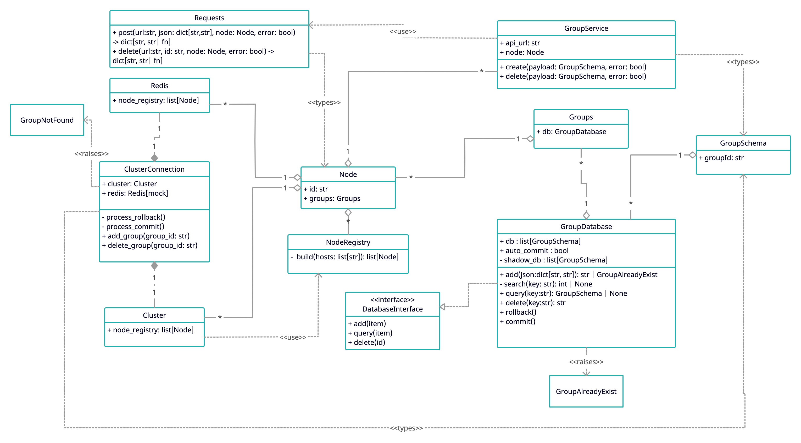

# API CONSUMER

## Description
Simple Python3 app that consumes external API while saving data to arbitrary number of nodes asynchronously. If one update fails in one of the nodes, all of the updates are rolled back; otherwise, commited.

Command line outputs are verbose to show the current running processes.

To run, you can execute `python index.py` to run the default scenario(see [Scenarios](#scenario "Scenarios")).

To check available cli arguments, run `python3 index.py -h`.

### CLI Arguments
You can specify a `--scenario` to run a specific scenario. When running a `--scenario=custom`, you can specify:
- `--n-nodes` number of nodes to add
- `--add-n-groups` number of groups to add
- `--remove-n-groups` number of groups to remove

### [Scenarios](#scenario)
1. Default Scenario ("default") - has 4 nodes; adds 2 groups; removes 1 group
2. Add Group Raising Error ("add_group_error") - has 4 nodes; adds 2 groups having the same ids
3. Remove Group Raising Error ("remove_group_error") - has 4 nodes; removes 1 group caugin error
4. Custom ("custom") - you can specify how many nodes to create, groups to add and remove

### Task Summary
Refer to python_challenge.pdf

## Code Design
The codebase is using a modified Observer Pattern for an object to listen to a certain event. It makes use of asynchronous techniques to make it efficient. All remaining tasks are cancelled when an exception occurs.

Mocks requests and database to fully show a working sample.

### Class Diagram

## File Structure
<pre>
.
├── cluster
│   └── __init__.py
├── groups
│   ├── __init__.py
│   ├── db.py
│   ├── schema.py
│   └── service.py
├── libraries
│   ├── __init__.py
│   ├── mockrequests.py
│   └── redis.py
├── nodes
│   ├── __init__.py
│   └── schema.py
├── tests
│   ├── __init__.py
│   ├── test_cluster.py
│   ├── test_groups.py
│   └── test_nodes.py
├── constants.py
├── event.py
├── interfaces.py
├── index.py
├── README.md
├── .coverage
├── .coveragerc
├── .gitignore
├── requirements.txt
└── setup.cfg
</pre>